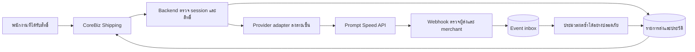

# แผนเชื่อมระบบขนส่งกับ CoreBiz Center

เอกสารนี้เริ่มจากข้อเสนอตาม [Working Brief](WORKING-BRIEF.md) และเพิ่มสถานะของส่วนที่พัฒนาแล้ว อ้างอิงโค้ด S6/S9 และสเปก S1 ใน [SOURCES.md](SOURCES.md)

## สถานะการพัฒนา ณ 8 กันยายน 2026

- ติดตั้งโครงสร้าง `shipments`, permissions, settings, COD account references, attempts และ audit บน Supabase แล้ว พร้อม RLS และ Edge Function ที่ตรวจสิทธิ์ทุกคำขอ
- หน้า CoreBiz รองรับร่างจากคำสั่งซื้อและร่างอิสระ ดึงรายการสินค้าจากบิล ค้นผู้รับจากลูกค้า/ประวัติส่ง และใช้ฐานรหัสไปรษณีย์ชุดเดียวกับหน้าลูกค้า
- เปลี่ยนตัวเลือกขนส่งเป็นการ์ดพร้อมโลโก้และชื่อบริการ รองรับมือถือ พร้อมปุ่มคัดลอก/เปิดลิงก์ติดตามเมื่อมีเลข Tracking
- พิมพ์ลาเบล J NAC 100 × 150 มม. หลายกล่องได้ พร้อมลำดับ `1/N`, Barcode, LINE QR, ผู้ส่ง/ผู้รับ, COD และหมายเหตุหน้ากล่อง
- Provider reads/mutations ยังปิด จึงยังไม่รับรองราคา สร้างพัสดุจริง ใบปะหน้าจาก provider หรือสถานะจริงจนกว่าจะผ่าน UAT และยืนยันการเงิน

## 1. ขอบเขตที่ยืนยันแล้ว

- ใช้ภายใน J NAC เพื่อส่งสินค้าของบริษัท
- สร้างรายการจากคำสั่งซื้อเดิมหรือสร้างรายการอิสระได้
- รองรับ COD ตั้งแต่ต้น
- พนักงานที่ได้รับสิทธิ์สร้างรายการส่งได้เอง ไม่ต้องให้หัวหน้าอนุมัติทุกครั้ง
- เติมเครดิตและตั้งค่าบัญชีรับเงิน COD เฉพาะ owner/admin

ยังไม่กำหนด carrier ที่เปิดใช้จริง, คลังต้นทาง, รายชื่อพนักงาน, รุ่นเครื่องพิมพ์, ปริมาณงาน, นโยบายส่งหลายกล่อง/บางรายการ และรูปแบบบัญชีวางบิลหรือเติมเครดิต รายการเหล่านี้อยู่ใน QUESTIONS และไม่ขัดขวางการอ่าน/ตรวจรับเอกสาร

## 2. สิ่งที่มีอยู่กับสิ่งที่ต้องเพิ่ม

| เรื่อง | ยืนยันจากโค้ด | ข้อเสนอเพิ่ม |
| --- | --- | --- |
| คำสั่งซื้อ | orders และ order_items; หน้า Orders; ordersApi | ปุ่มสร้างรายการส่งจาก order และความสัมพันธ์ shipment แยกต่างหาก |
| ที่อยู่ลูกค้า | orders/customers มี shipping_address แบบ JSON; สาขามี address | ฟอร์ม structured address และ snapshot ผู้ส่ง/ผู้รับ ตรวจฟิลด์ตาม OP02 |
| น้ำหนักสินค้า | products.weight_kg มีอยู่ | ใช้แนะนำค่า g โดยคูณ 1000 แต่ต้องชั่งน้ำหนักรวมกล่องจริง; ไม่เดาค่าที่เป็น null |
| คลัง | warehouses มี code/address/is_default | origin profile ที่มีชื่อ เบอร์ อีเมล ตำบล อำเภอ จังหวัด รหัสไปรษณีย์; mapping warehouse_no ของ provider |
| ขนส่ง | order มี carrier/tracking_no/shipping_fee | แยก shipment, items, events, attempts, pickup และข้อมูลการเงิน |
| สิทธิ์ | role และ is_active; helper can_write ใช้ owner/admin/staff | สิทธิ์เฉพาะจัดส่งรายบุคคล; ห้ามถือว่า staff ทุกคนได้รับสิทธิ์แล้ว |
| สถานะ | order status มีผลต่อ stock และ loyalty | เก็บสถานะ provider แยก; ไม่เขียนกลับอัตโนมัติในระยะแรก |
| UI | lazy route, data layer, cache, i18n เดิม | เสนอ `/center/shipping` และหน้าตั้งค่าขนส่ง จำกัดสิทธิ์ตามงาน |

`ordersApi.getById` เลือก customer บางฟิลด์ที่ยังไม่ครบชื่อ/เบอร์/อีเมล/ที่อยู่สำหรับส่ง จึงต้องอ่านข้อมูลที่จำเป็นเพิ่มเติมและให้พนักงานตรวจทาน ไม่ใช้ billing_address แทน shipping_address โดยเงียบ ๆ

## 3. สถาปัตยกรรมที่เสนอ

ชื่อ route/function/table ในเอกสารเป็นข้อเสนอ ไม่มีการสร้างจริง ให้เพิ่มตาม pattern เดิมใน `frontend/src/App.tsx`, เมนู layout, `frontend/src/lib/api.ts`, cache และ i18n TH/EN โดยใช้ Supabase backend เดิม หลีกเลี่ยงการให้ browser เรียก provider ด้วย merchant secret

หน้าพนักงานเรียก backend ที่ตรวจ session, profile.is_active และสิทธิ์จัดส่งจากข้อมูลที่ผู้ใช้แก้เองไม่ได้ ตรวจซ้ำก่อน mutation ทุกครั้ง แม้ UI ซ่อนปุ่มแล้ว ฝั่ง webhook ตรวจตัวตน provider แยกจาก Supabase user JWT; หากใช้ service-role ต้องตรวจ merchant/สิทธิ์ภายใน handler เพราะ key นี้ bypass RLS ตาม [Supabase secrets](https://supabase.com/docs/guides/functions/secrets)

ใช้ [RLS](https://supabase.com/docs/guides/database/postgres/row-level-security) และ grant จำกัดตารางที่ expose ให้ตรงสิทธิ์ ไม่ใช้เพียงเงื่อนไข logged-in ทุกคน backend-only fields เช่นสถานะจาก provider, cost, request outcome และ COD settlement ห้ามให้ client update ตรง

## 4. ขั้นตอนงาน

### 4.1 ส่งจากคำสั่งซื้อ

1. พนักงานเปิด order และเลือกสร้างรายการส่ง
2. ระบบอ่านรายการสินค้า/ที่อยู่ที่จำเป็น ตรวจว่ามีรายการส่งค้างหรือสำเร็จอยู่แล้ว เพื่อเตือนการส่งซ้ำ
3. พนักงานยืนยันผู้ส่ง ผู้รับ เบอร์ ที่อยู่ และรายการสินค้าที่อยู่ในกล่อง
4. กรอกขนาดและน้ำหนักรวมกล่อง เลือก COD หรือไม่ COD และยอดที่ต้องเรียกเก็บตามนโยบายที่ยืนยันแล้ว
5. ตรวจที่อยู่และเช็กราคา แสดงว่าเป็นราคาประเมินพร้อมเวลาที่ตรวจ; ถ้าแก้ที่อยู่/น้ำหนัก/ขนาด/carrier ให้ราคาเดิมหมดอายุ
6. แสดงสรุปผู้รับ พัสดุ ขนส่ง ยอด COD และค่าใช้จ่าย พนักงานกดสร้างรายการส่ง เป็นการยืนยันรายการโดยคนส่ง ไม่ใช่การเพิ่มขั้นหัวหน้าอนุมัติ
7. Backend บันทึกคำขอพร้อม ID ภายในก่อนเรียก OP02 และบันทึกผลตอบกลับ/เลขติดตาม
8. พิมพ์ใบปะหน้าผ่าน OP04; ถ้าพิมพ์ล้มเหลวให้พิมพ์ซ้ำจาก shipment เดิม ไม่สร้างพัสดุใหม่
9. เรียกรถเมื่อบริการและต้นทางรองรับ หรือใช้วิธีส่งมอบที่ธุรกิจยืนยัน เก็บสถานะ pickup แยก
10. รับสถานะ/ราคาเพิ่มภายหลัง และแสดงงานที่ต้องตรวจสอบโดยพนักงาน

### 4.2 รายการส่งอิสระ

ใช้ขั้นตอนเดียวกัน แต่ `order_id` เป็น null และออก `reference_no` ภายใน เช่น `SHP-<RUNNING_NUMBER>` ตามรูปแบบที่ทีมเลือก มีเหตุผลการส่ง เช่น ตัวอย่างสินค้า เอกสาร หรือของเคลม จะเลือกลูกค้าเดิมหรือกรอกผู้รับใหม่ก็ได้ โดยไม่บังคับสร้างคำสั่งซื้อปลอม

การส่งอิสระไม่ตัดสต็อกโดยอัตโนมัติในข้อเสนอรอบแรก หากเป็นตัวอย่างสินค้าจากคลังให้วางกระบวนการเบิกตามระบบคลังแยก เพื่อไม่ตัดซ้ำกับ trigger order

### 4.3 COD

- ฝั่ง server เลือกได้เฉพาะบัญชี COD ที่ owner/admin ตั้งค่าและ provider อนุมัติ ไม่รับ ID อิสระจาก client
- บันทึกยอดเรียกเก็บแยกจากค่าขนส่ง ค่าธรรมเนียม ภาษี และยอดเงินโอนจริง
- การเลือก COD ต้องตรวจข้อจำกัด carrier และบัญชีที่เปิดใช้; เมื่อข้อมูลยังไม่ยืนยันต้องไม่เปิดส่ง COD จริง
- กรณี order ชำระไปบางส่วน/ใช้เครดิต/มีหลาย shipment ต้องกำหนดสูตรยอดคงเหลือและกันยอด COD ซ้ำ ห้ามใช้ `orders.total` เป็น COD ทุกกรณี
- ใช้สถานะเงินแยกจากสถานะพัสดุ เช่น รอข้อมูล / รอกระทบยอด / ยืนยันรับเงิน; ชื่อเหล่านี้เป็นสถานะภายใน ไม่ใช่ enum ของ provider
- OP13 delivered ไม่เปลี่ยน `orders.payment_status` เป็น paid; OP14 cod_price/cod_tax คือข้อมูลค่าบริการ ไม่ใช่หลักฐานโอนเงิน COD
- สเปกไม่มี settlement/account API จึงต้องขอข้อมูลเพิ่ม หากให้รายงานแทน API ให้เสนอการนำเข้ารายงานโดยผู้มีสิทธิ์เป็นงานเพิ่มเติม ไม่อ้างว่ามีอยู่แล้ว

### 4.4 เครดิตและการวางบิล

แผนยังไม่ผูกการสร้าง shipment เข้ากับการเติม Wallet เสมอไป ให้ยืนยันโหมดบัญชี `prepaid`, `postpaid` หรือรูปแบบอื่นจากผู้ให้บริการก่อน (ชื่อโหมดเป็นคำอธิบายแผน ไม่ใช่ enum จาก API)

ถ้าใช้ prepaid: OP08 เป็นการยื่นรายการเติม ไม่เท่ากับอนุมัติยอด; จำกัด owner/admin, เก็บหลักฐานแบบ private, ป้องกัน submission ซ้ำ และรอแหล่งยืนยัน available balance

ถ้าใช้ postpaid: วางรายการค่าใช้จ่ายและกระทบยอดตามเอกสารที่ผู้รับผิดชอบยืนยัน ไม่เปิดการเติมอัตโนมัติ ไม่ตั้งวงเงินหรือรอบชำระเงินขึ้นเอง

## 5. สิทธิ์ที่เสนอ

| งาน | พนักงานได้รับสิทธิ์จัดส่ง | owner/admin | สถานะข้อกำหนด |
| --- | --- | --- | --- |
| สร้างรายการส่งทั้งสองแบบ | ได้ | ได้ | ยืนยันโดย Boss jack |
| สร้าง COD ด้วยบัญชีที่อนุมัติแล้ว | ได้ | ได้ | สอดคล้อง Brief; จำกัดเลือกบัญชีที่อนุมัติ |
| เติมเครดิต/เปลี่ยนบัญชี COD | ไม่ได้ | ได้ | ยืนยันโดย Boss jack |
| อ่านรายการส่งและพิมพ์ใบปะหน้า | เสนอให้ได้ตามขอบเขตงาน | ได้ | ข้อเสนอ |
| เรียกรถ/ยกเลิก shipment หรือ pickup | เสนอให้ได้พร้อมยืนยันและบันทึกเหตุผล | ได้ | ต้องยืนยันนโยบายธุรกิจ/ข้อจำกัด provider |
| ดูรายงานต้นทุน/เงินโอน COD ทั้งหมด | ยังไม่เปิดเป็นค่าเริ่มต้น | ได้ | ข้อเสนอ |
| แก้สิทธิ์พนักงาน/credential | ไม่ได้ | ได้ | ข้อเสนอให้ใช้รูปแบบผู้ดูแลเดิม |

agent/viewer/customer หรือ staff ที่ไม่ได้รับสิทธิ์จัดส่งไม่ควรสร้าง/ยกเลิก/เติมเครดิตผ่าน API ได้ แม้เข้าหน้า back office ได้ การเข้าถึงข้อมูลอ่านของแต่ละบทบาทต้องตัดสินใจก่อน migration

## 6. แบบข้อมูลที่เสนอ ไม่ใช่ migration

| กลุ่มข้อมูล | ฟิลด์สำคัญ/ความสัมพันธ์ | กติกา |
| --- | --- | --- |
| `shipping_accounts` | provider, environment, merchant_code, credential reference, billing mode | ไม่เก็บ secret ในตารางที่ frontend อ่านได้; owner/admin เท่านั้น |
| `shipping_permissions` | user_id, capability, granted_by, revoked_at | server ตรวจสิทธิ์ปัจจุบัน; ผู้ใช้ให้สิทธิ์ตนเองไม่ได้ |
| `shipping_origins` | warehouse_id, provider warehouse_no, structured address/contact | ไม่ถือว่า warehouses.code เท่ากับ warehouse_no |
| `shipments` | id, nullable order_id/customer_id, source_kind, reference_no, external_id, account_id, carrier_code, tracking_number, dimensions_cm, weight_g, COD snapshot, address snapshots, created_by | unique external_id ในขอบเขตบัญชี/environment; tracking ไม่ใช้เป็น unique global โดยไม่รู้เงื่อนไข |
| `shipment_items` | shipment_id, nullable order_item_id, qty, SKU/name/price/weight snapshot | รองรับรายการอิสระ; กันส่งเกินจำนวนหากเปิด partial shipment |
| `shipment_attempts` | operation, request ID ภายใน, outcome, HTTP status, provider request_id, sanitized error, started/finished_at | บันทึก pending ก่อน external call; ผล unknown ไม่ใช่ failed ที่ส่งใหม่ได้ทันที |
| `shipment_events` | account/merchant, event type, tracking/ticket, provider timestamp, received_at, verification result, dedupe key, processed state | append-only; เก็บ raw payload จำกัดสิทธิ์และระยะเวลา |
| `shipment_financial_events` | shipment_id, event type, rate version, amount components, transaction reference ถ้ามี | กันรายการเงินซ้ำ; estimated/current/final แยกกัน; ไม่บวกรวมทุก event โดยไม่รู้ความหมาย |
| `pickup_requests` | local ID, provider ticket, warehouse/carrier, state, estimate_time, driver contact | แยก status และ attempt จาก shipment; shipment links หลังยืนยัน provider model |
| `cod_accounts` / `cod_reconciliations` | approved provider account ID, masked label; expected/settled values, evidence reference | ไม่มี API provisioning/settlement ยืนยันในไฟล์นี้; อย่าแสดงว่าโอนแล้วจาก delivered |

ข้อเสนอ schema ใช้ความสัมพันธ์ order 1:N shipment เพื่อไม่ติดข้อจำกัดหนึ่งเลขติดตามใน orders แต่การเปิด UI ส่งหลายกล่อง/บางรายการต้องให้ทีมยืนยัน ไม่ควรเปิดโดยไม่มีการตรวจจำนวนสินค้าและยอด COD

### Mapping หลัก

| CoreBiz | Provider | การเตรียมข้อมูล |
| --- | --- | --- |
| `orders.id` / `orders.code` | `reference_no` | เลือกรูปแบบเดียวและเก็บ mapping ชัดเจน; ไม่อ้างว่า provider enforce unique |
| shipment UUID ภายใน | `external_id` | สร้างครั้งเดียวสำหรับคำขอธุรกิจใหม่ เก็บก่อนส่ง; retry รอข้อตกลง |
| `shipping_address` | `destination.*` | JSON ยังไม่รับรอง schema ที่ครบ แปลงแล้วให้พนักงานยืนยัน |
| customer phone/email | `telephone1` / `email` | อ่านจาก source ที่มีจริง ไม่สร้างค่าแทนลูกค้า |
| `products.weight_kg` | ค่าช่วยกรอกน้ำหนัก | kg × 1000; box_weight ใช้น้ำหนักรวมกล่องจริง; products.weight รอยืนยันหน่วย |
| order_items | `products[]` | snapshot และตรวจชื่อ/จำนวน/ราคา; ไม่แปลงทศนิยมเป็น integer โดยตัดทิ้ง |
| origin profile | `origin.*` / pickup fields | ครบตาม schema provider; warehouse mapping แยก |
| `data.tracking_number` | `shipments.tracking_number` | ไม่สูญเสียหลายรายการส่งด้วยการเขียนทับ order.tracking_no |
| estimate/actual/provider charge | ตารางการเงินขนส่ง | ไม่เขียนทับ `orders.shipping_fee` ซึ่งอยู่ในยอด order โดยอัตโนมัติ |

เงินใช้ decimal representation ที่แน่นอนภายใน แยก currency/scale เมื่อผู้ให้บริการยืนยัน ไม่ใช้ floating-point บวกเงินซ้ำ ๆ; เก็บ timestamp ต้นฉบับพร้อมค่าที่ normalize และแสดง Asia/Bangkok โดยคำนึงถึง offset จริง

## 7. สถานะและผลกระทบต่อระบบเดิม

| สถานะจาก provider | แสดงในงานขนส่ง | นโยบาย order/stock ที่เสนอ |
| --- | --- | --- |
| waiting | รอส่ง | ไม่ถือว่าออกจากคลังแล้วเพียงเพราะมี label |
| on_delivery | กำลังจัดส่ง | เก็บใน shipment; การ sync order ต้องมี rule แยก |
| delivered | ส่งสำเร็จ | ไม่ยืนยัน COD paid; หลาย shipment ต้องประเมินครบก่อน |
| on_return | กำลังตีกลับ | ยังไม่รับคืนสต็อก |
| returned | ขนส่งแจ้งส่งคืน | ให้คลังตรวจรับคืนก่อนปรับ stock/order |
| claimed / closed | ต้องตรวจสอบ | ไม่เท่ากับส่งสำเร็จหรือคืนเงิน |
| canceled | ยกเลิกพัสดุ | ไม่เท่ากับ order.cancelled; อาจสร้างใบส่งใหม่ของ order เดิม |

สถานะใน CoreBiz ใช้ `cancelled` แต่ provider ใช้ `canceled` และมี enum มากกว่า ห้าม cast string ข้ามกันโดยตรง; pickup.pending/on_process/completed/canceled เป็นคนละชุดกับ shipment

จาก migration 0006 การเข้า processing/shipped/delivered จากกลุ่มก่อนหน้าตัด stock และการเปลี่ยนเป็น cancelled/returned จากกลุ่ม committed คืน stock อีกทั้งมี loyalty/payment logic ใน migration 0007 ดังนั้นระยะแรกอัปเดต shipment อย่างเดียว และออกแบบ order synchronization แยกพร้อม regression tests ก่อนเปิดใช้

## 8. ป้องกันรายการซ้ำและข้อมูลย้อนสถานะ

- ใช้ local transaction/lock ให้การกดสองครั้งเกิด attempt เดียวในสถานะกำลังส่ง ปิดปุ่มอย่างเดียวไม่พอ
- ถ้า timeout หลังส่ง OP02 ให้สถานะ `outcome_unknown` ภายใน เก็บ external_id/reference เดิม ห้ามออก ID ใหม่แล้ว retry เพราะอาจมีพัสดุและค่าบริการเดิมแล้ว
- OP03 ค้น tracking ได้ตามเอกสาร แต่ถ้า timeout ก่อนรู้ tracking ยังไม่มีหลักฐานว่าใช้ reference/external ID ค้นได้ ต้องให้ provider ยืนยันวิธีกู้ ไม่อ้างว่าแก้ได้ด้วย list search เสมอ
- แยก retry สำหรับ read-only ออกจาก mutation; cancellation/pickup/deposit ต้องตรวจผลซ้ำตาม contract ที่ provider ให้
- callback เข้าก่อน create response ต้องเก็บ event ไว้เพื่อเชื่อมภายหลัง ไม่ทิ้ง event ที่ยังหา shipment ไม่เจอ
- ใช้ provider event ID หากมี ถ้าไม่มี hash ของ payload เป็นเพียงตัวช่วยกัน identical delivery; สำหรับเงินไม่รับรองว่าแยกธุรกรรมสองรายการที่เหมือนกันได้ ต้องมี transaction identity/กฎจาก provider
- เก็บเหตุการณ์ทุกครั้งพร้อม provider time และ receive time; event เก่าหรือข้ามสถานะส่งเข้าตรวจสอบแทนการเลือกสถานะสูงสุดด้วยลำดับตัวเลข
- งาน polling/reconciliation ต้องแบ่งหน้า ใช้ host ที่อนุญาต และกำหนดความถี่ภายหลังทราบ rate limit ยังไม่สร้าง cron ในรอบนี้

## 9. ข้อมูลส่วนบุคคลและเอกสาร

ให้พนักงานเห็นเฉพาะข้อมูลผู้รับที่จำเป็นต่อการส่ง จำกัดการเข้าถึง label/slip/driver contact และ audit ผู้เปิด/แก้รายการ เก็บ snapshot เพื่อรักษาประวัติการส่งโดยมีนโยบาย retention ที่องค์กรกำหนด

ไม่บันทึก auth query, base string, Bearer token หรือ signed label URL ใน log ทั่วไป ไม่อนุญาตให้ client เปลี่ยน URL provider เอง ไม่ส่ง raw cost/margin response ไป storefront, RAG หรือ bot และไม่ใช้ PDF เอกสารสมัครบริการเป็น fixture ทดสอบ

## 10. ลำดับพัฒนาและเงื่อนไขก่อนเปิดใช้

| ระยะ | งานที่เสนอ | หลักฐานก่อนผ่านระยะ |
| --- | --- | --- |
| A ยืนยันสเปก | ตอบคำถาม P0, API version, billing mode, merchant/warehouse/COD IDs, UAT test vector | ผู้ให้บริการยืนยัน method/auth/webhook/idempotency และข้อมูล COD ที่ใช้จริง |
| B โครงสร้างภายใน | สิทธิ์ ตาราง รายการ draft สองแบบ adapter แบบ mock | ทดสอบ authorized/unauthorized, ที่อยู่ขาด, น้ำหนัก/เงิน, กดซ้ำ โดยไม่แตะ provider |
| C UAT ขนส่ง | เช็กราคา สร้าง non-COD และ COD พิมพ์ ยกเลิก pickup callbacks | ต้องมีอนุญาตทดสอบ UAT แยก, test account ที่ไม่คิดเงินจริง และ payload/response ครบ |
| D การเงิน | โหมดบัญชี, price adjustment, COD reconciliation, owner/admin settings | ไม่ลงเงินซ้ำ ไม่ถือ delivered เป็น paid พิสูจน์ยอดกับแหล่งข้อมูลที่ provider รับรอง |
| E Pilot | จำกัดพนักงาน/ต้นทาง/carrier, runbook/monitoring | Boss jack อนุญาตเปิดใช้จริง; ตรวจ deployed schema/functions และทดสอบปลายทางตาม scope ใหม่ |

COD อยู่ในแบบข้อมูลและการทดสอบตั้งแต่ต้น การแยกระยะ D ไม่ใช่เลื่อน COD ออกจากขอบเขต แต่แยกการพิสูจน์ยอดเงินจริงออกจากการสร้างพัสดุ

ก่อนแก้/ใช้ Supabase ให้ตรวจ deployed source และ migration history จริงตาม PROJECT_STANDARDS ไม่แก้ applied migration ย้อนหลัง ไม่กำหนดชื่อ migration ล่วงหน้าจากเลขในเอกสารเก่า การทดสอบและ deployment ในตารางเป็นแผนอนาคต ยังไม่ได้ดำเนินการ

### ชุดสถานการณ์ตรวจรับสำหรับการพัฒนาในอนาคต

1. ส่งจาก order กับส่งอิสระได้ และข้อมูลเดิมของ order/customer ไม่ถูกเขียนทับโดยไม่ตั้งใจ
2. staff ที่ไม่ได้สิทธิ์, viewer, customer, inactive user เรียก mutation ตรงแล้วถูกปฏิเสธ
3. พนักงานจัดส่งเปลี่ยน cod_account หรือ amount หลัง backend ตรวจแล้วไม่ได้; owner/admin เปลี่ยนการตั้งค่ามี audit
4. กดสร้างซ้ำ/timeout แล้วไม่สร้างพัสดุหรือ debit ซ้ำ; unknown outcome มีทางแก้ที่ provider รับรอง
5. webhook ปลอม/ผิด merchant ถูกปฏิเสธ; ซ้ำ/ย้อนลำดับ/มาก่อน response ประมวลผลได้ถูกต้อง
6. ยกเลิก label หรือรับ returned event ไม่คืน stock จนคลังยืนยันตาม workflow
7. delivered ไม่เปลี่ยน COD เป็น paid; price/company_price ซ้ำไม่บวกยอดซ้ำ
8. label หมดอายุ/พิมพ์ล้มเหลวพิมพ์ใหม่จาก shipment เดิมได้ตามเงื่อนไข provider
9. น้ำหนักเกิน/พื้นที่ไม่รองรับ/อีเมลขาด/ราคาเปลี่ยนหลังแก้กล่องแจ้งผู้ใช้ก่อนส่ง
10. ถ้ารองรับหลาย shipment ตรวจจำนวนรวมและยอด COD ไม่เกิน order; ถ้ายังไม่รองรับให้ปิด flow นั้นชัดเจน
